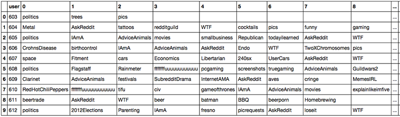
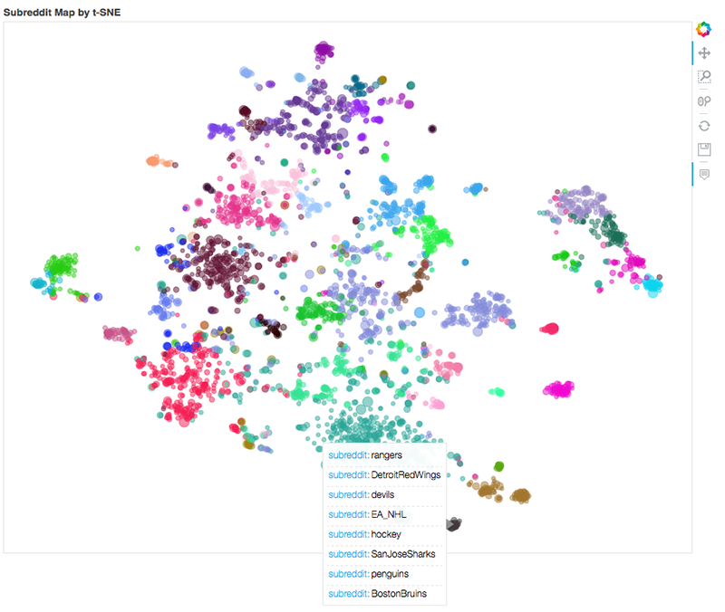

# Unsupervised learning applied to the analysis of [Reddit](www.reddit.com) user preferences using Latent semantic analysis (LSA)

This tutorial is one of the demos used in the course “Introduction to Machine Learning” at MINES ParisTech - PSL Research University, lectured by Simon Tamayo.

The underlying idea of _Latent semantic analysis_ (LSA) is that the aggregate of all the word contexts in which a given 
word does and does not appear provides a set of mutual constraints that largely determines the similarity of meaning of 
words and sets of words to each other [1]. In other words: LSA assumes that words that are close in meaning will occur 
in similar pieces of content.

In this example, we use LSA to identify _subreddits_ that are "close" by supposing that users with similar preferences 
will often visit similar _subreddits_. The idea is then to go from input data that looks like this:

 

To a map of concepts that looks like this:

 

## Acknowledgement

Most of this demo was adapted from the work of @nicolaskruchten (from DataCratic). A very pedagogical explanation of 
this type of implementation was given by N. Kruchten in [this video](https://youtu.be/2lpS6gUwiJQ), the original version 
of his code can be found [here](http://opensource.datacratic.com/mtlpy50/).

## Getting Started

Before running this code make sure you have Python3 and the packages: pandas, numpy, scipy, scikit-learn and bokeh.

## Built With

* [scikit-learn](http://scikit-learn.org) - Machine learning platform

## References

[1] T. K. Landauer, P. W. Folt, and D. Laham, “An introduction to latent semantic analysis,” Discourse Process., 
vol. 25, no. 2, pp. 259–284, 1998.

This project is licensed under the MIT License - see the [LICENSE.md](https://opensource.org/licenses/mit-license.php) file for details